# VLS (Virtual Live Streaming System)
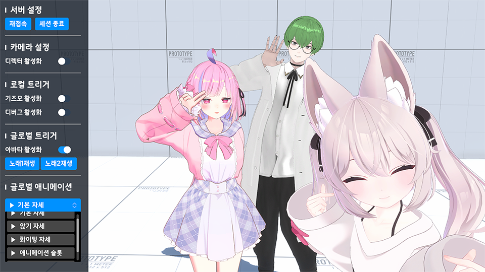

다수의 유저가 한 세션에 접속해서 함께 버추얼 방송을 할 수 있는 프로젝트입니다. 

&nbsp;
## 개요
VR의 한계점과 페이셜을 사용하려면 추가 부품 구매 등의 불편함이 있습니다.

이제는 간편하게 핸드폰 또는 웹캠과 마이크만 있으면 3D 모델을 움직이고 페이셜도 가능합니다. 
여기서 착안해 각 유저가 사용하는 기기에서 모델의 실시간 정보를 받아와 한 세션에 합쳐서 모두가 통신할 수 있도록 개발되었습니다.

별도의 스튜디오나 현실 만남의 과정 없이 모든 유저의 정보를 같이 송출하세요!

&nbsp;
## 주요 기능
- **멀티 플레이**: 여러 유저가 동시에 한 세션에 접속할 수 있습니다.
- **모션 레코딩**: 세션에 참가한 유저들의 모션을 실시간으로 녹화하고 재생할 수 있습니다.
- **스태프 지원** :  스태프는 각 유저의 아바타 위치, 애니메이션, 의상 변경 등의 작업을 쉽게 수행할 수 있습니다.
- **데이터베이스**: 세션에서 진행 중인 이벤트나 중요한 정보들을 따로 관리하고, 데이터베이스에 저장합니다.
- **디렉터**: 사전에 정의된 타임라인 카메라나 특정 기능을 포함한 카메라 등을 핫스왑으로 빠르게 세션 내 모든 유저와 통신할 수 있습니다.
- **확장성**: 프로젝트 이용자의 용도에 따라 더 많은 기능을 추가할 수 있습니다!

&nbsp;
## 기본 기능
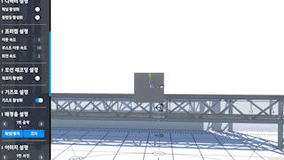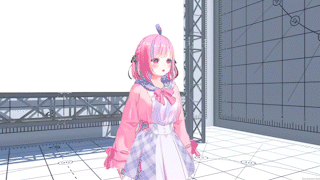
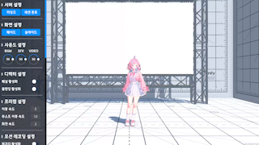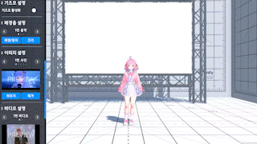
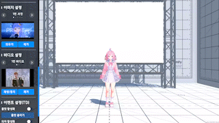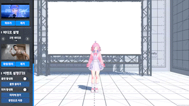

&nbsp;
## 아키텍처
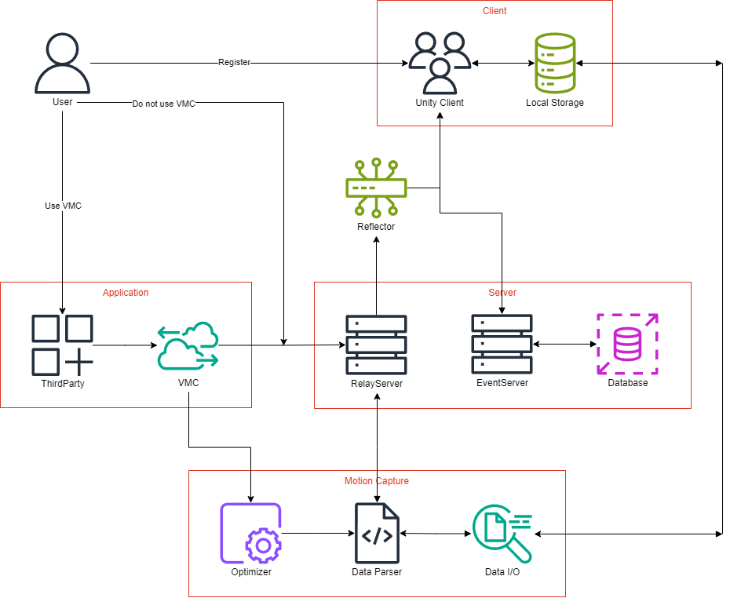

&nbsp;
## 사용 사례
##### 유봄냥 방송 1주년 기념 봄니티 (https://youtu.be/zq670xt7Qjw?si=A1qmPcl52wVcc4Gi)
<a href="https://youtu.be/zq670xt7Qjw?si=A1qmPcl52wVcc4Gi">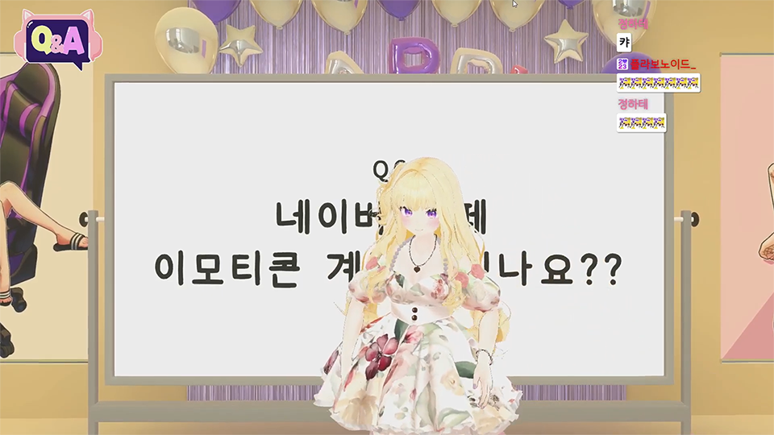</a>

---

##### 단츄 발렌타인 기념 단니티 (https://vod.afreecatv.com/player/116208033)
<a href="https://vod.afreecatv.com/player/116208033">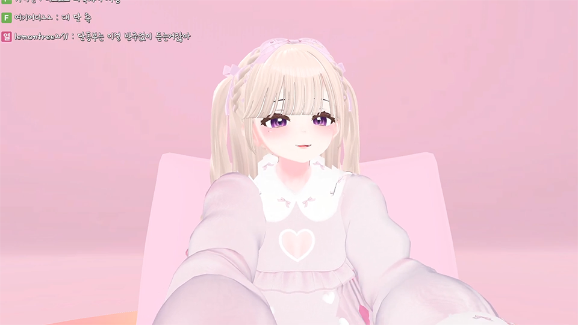</a>

---

##### 단츄 ASMR (https://vod.afreecatv.com/player/117234827)
<a href="https://vod.afreecatv.com/player/117234827">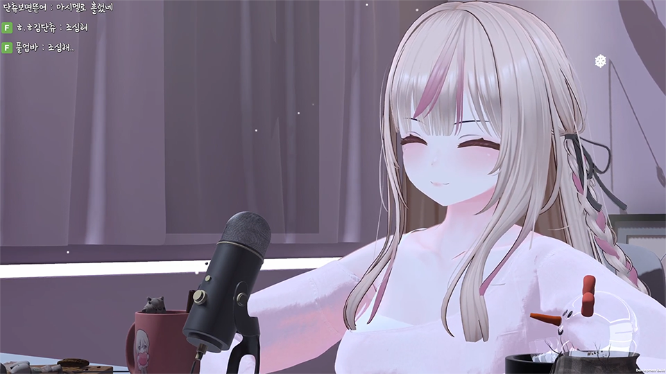</a>

---

###### 준비 중... 추가 예정
